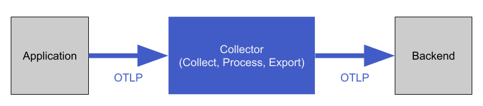

!SLIDE subsection
# ~~~SECTION:MAJOR~~~ OpenTelemetry

!SLIDE

# What is OpenTelemetry?

OpenTelemetry (OTel) is a collection of APIs, SDKs, and tools.

Designed to instrument, generate, collect, and export telemetry data aka. signals (metrics, logs, and traces).

OpenTelemetry tries to standardize software telemetry data.

!SLIDE

# What is OpenTelemetry not?

OTel is not an observability product.

OTel is not a backend for the data.

OTel is not a visualization tool.

The storage and visualization of telemetry is intentionally left to other tools.

!SLIDE

# Specifications and Components

OpenTelemetry is developed on a signal by signal basis. Each of which consists of four components:

* API, technical specifications and documentation
* SDK, tools for a specific platform
* Collector
* OpenTelemetry Protocol (OTLP)

Components follow a development lifecycle: Draft, Experimental, Stable, Deprecated, Removed.

!SLIDE

# API, SDK and the Collector

More on the Collector later. First we focus on the API and SDK.

!SLIDE noprint

# Let's look at the Project

* https://opentelemetry.io/
* https://opentelemetry.io/docs/
* https://github.com/open-telemetry/
