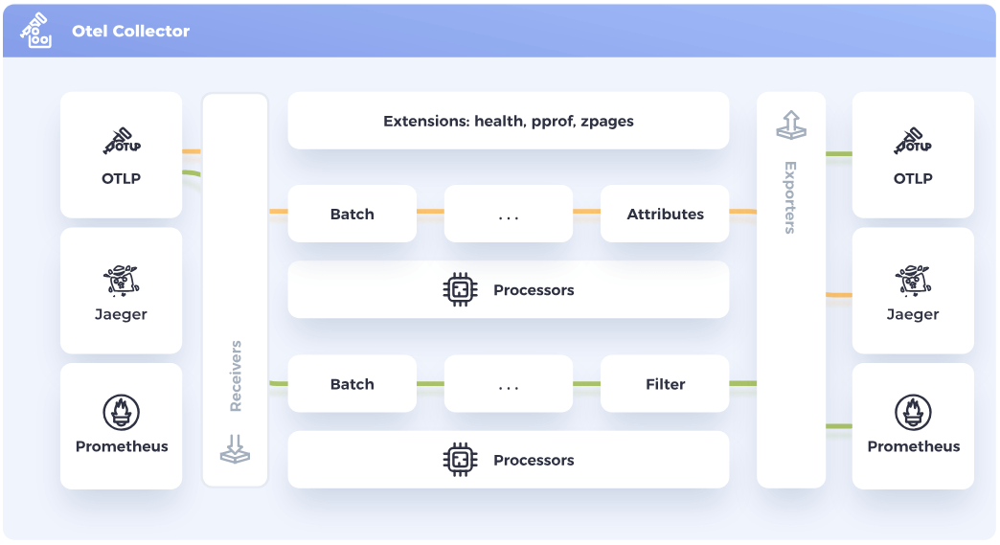

!SLIDE

# The Collector

The OpenTelemetry Collector is a vendor-agnostic proxy that can receive, process, and export telemetry data.

It also supports processing and filtering telemetry data before it gets exported.

!SLIDE

# When to use the collector

For most language specific instrumentation libraries you have exporters for popular backends and OTLP. Why use another tool?

The Collector allows the service to offload data quickly and the collector can take care of the rest.

Handling retries, batching, encryption or even sensitive data filtering.

!SLIDE

# Installation

There are various ways to install the Collector:

* Packages from the Collector Release repository
* Container Images on `docker.io/otel/opentelemetry-collector-contrib`
* OpenTelemetry Helm Charts or the Kubernetes Operator

https://github.com/open-telemetry/opentelemetry-collector-releases

!SLIDE

# Configuration

The structure of any Collector configuration file consists of four classes:

* Receivers
* Processors
* Exporters
* Connectors

!SLIDE

# Configuration Structure

    @@@Yaml
    receivers:
      otlp:
        protocols:
          grpc:
            endpoint: 0.0.0.0:4317
    processors:
      batch:

    exporters:
      debug:
        verbosity: detailed

    service:
      pipelines:
        logs:
          receivers: [otlp]
          processors: [batch]
          exporters: [debug]

See: Lab 4.1
