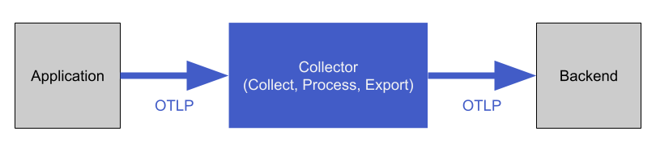

!SLIDE

# OpenTelemetry Consumers

There are many solutions that consume OTLP natively. Some are open source some are not.

How data is stored, aggregated, visualized and other features depend on the vendor:

https://opentelemetry.io/ecosystem/vendors/

See: Lab 5.1
